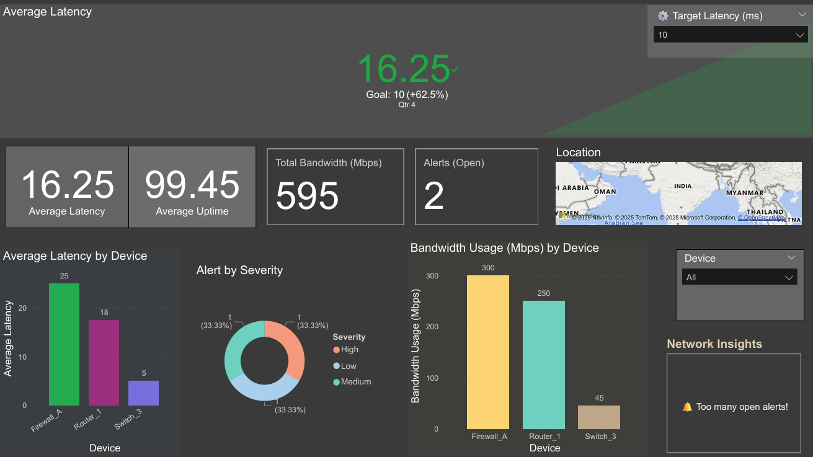

# 🔌 Network Performance Monitoring Dashboard (Power BI)

This dashboard provides insights into the health and performance of a simulated network (Using Sample Datasets).

## 📊 Features
- KPI cards: Latency, Uptime, Alerts
- Device-wise analysis
- Alert severity breakdown
- Interactive target threshold slicer
- Location map
- Dynamic summary/insight card

## 📁 Files
- `network_dashboard.pbix`: Power BI file
- `/data/`: Contains Excel file used as datasets

## 💡 Tools Used
- Power BI Desktop
- DAX for KPIs and dynamic measures

## 📊 Dashboard Preview

